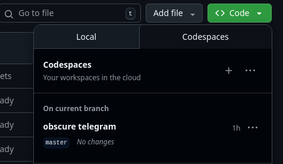

# TAMU OSOS 2025

Materials for the modules on

- Introduction to Python (Trevor Millnar)
- Python for Data Science (Dan Drennan)

Taught at Texas A&M's OSOS 2025 seminar in College Station, TX.

## Python for Data Science

### Upload documents

Many of the files available in Google Drive at:

- [Google Drive](https://drive.google.com/drive/u/1/folders/1DvTzzytLlg3ZnBIKHKbGk8AGGeR3iiQq)

## Dev Container

This repo provides a Dev Container for trying a fully integrated developer
experience from the browser. The purpose of the Dev Container is to run the
Jupyter notebooks that are included in this shell, *not to develop or modify the
`osos` package managed by `uv`*. The Dev Container is runnable in the browser
using GitHub Codespaces or locally buildable using Docker and VS Code. Brief
instructions for each are provided.

### Using GitHub Codespaces

Codespaces in this repo are free to use and run 100% in the browser. To try the
Codespace associated with this repo:

1. go to the top of the repo
2. click the `code` drop down
3. click the `Codespaces` tab
4. Choose a codespace to open (the one associated with the default/master branch
   is preferred)

An image of what should be seen in step 4 is shown below:

> [!NOTE]
> This is a public repository. The browser-based code space should be available
> at no cost to you to try. If you like the experience, consider replicating
> some of it locally in your machine using the next set of instructions.

### Using Local Dev Containers

Local Dev Containers run in VS Code and require some additional software to run.
The software required for using local Dev Containers includes:

- [Docker](https://docs.docker.com/engine/install/)
- [VS Code](https://code.visualstudio.com/download)
   - The [Dev Containers](https://marketplace.visualstudio.com/items?itemName=ms-vscode-remote.remote-containers) extension inside VS Code

After installing the dependencies, clone the repository and open VS Code inside
of it. Then VS Code will ask if you want to build the Dev Container for local
use.
